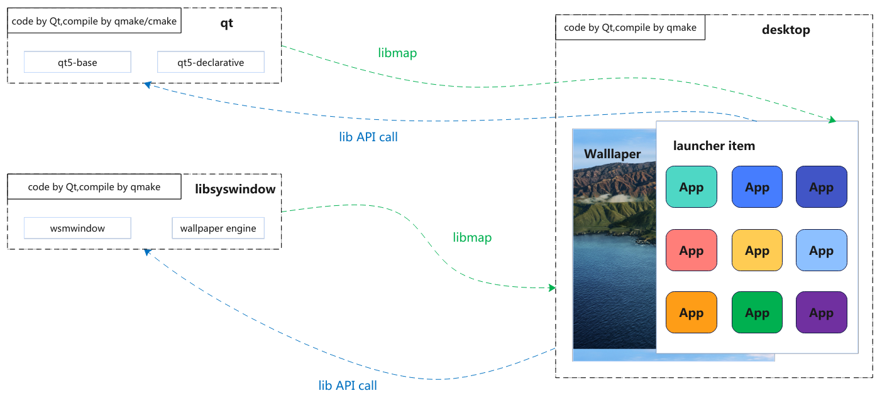

# desktop
desktop items

## Frame


## Release Signatures

## Installation

### From Packages

### Compiling from Source
Install dependencies:

* qt5-base \*
* qt5-declarative \*
* libsyswindow \*

Run these commands:
```shell
    mkdir build
    cd build
    qmake ..
    sudo make install -j16
```

## Configuration


## How to Contribute
* Contributing just involves sending a merge request.
* Note: rules are made to be broken. Adjust or ignore any/all of these as you see
fit, but be prepared to justify it to your peers.

### Code Style
* When modifying existing code, the current code style should be respected.
* New code: the part should follow the code style of Qt (https://wiki.qt.io/Qt_Coding_Style this link is for reference only. The actual Qt source code shall prevail)
* There is no absolute right or wrong code style, please consider the big picture, and do not rigidly stick to the small details

### Code Architecture Guidelines
* The code should be simple and easy to understand.
* Add comments to key nodes whether you change or add new code
* Security > Compatibility > Extensibility >= Performance

### Contribution Guideline
* Contribution steps.
    1. First login to your Github/Gitee account and fork the project
    2. Pull the forked project locally using `git clone`.
    3. Push the new commit to your project using `git push`.
    4. commit your code to the upstream project on Github/Gitee using the Pull Requese feature.
* commit message specification: align with Qt project, use English. Be sure to describe exactly what the commit "does" and "why it was made"
* A commit only does one thing, and the smaller the code changes, the easier it is to accept the commit. For larger code changes, try to split the commit into multiple commits (satisfying the git commit principle as a prerequisite)
* Please do your own testing and code review before committing the code, and submit the PR after confirming that the code is working correctly

## Roadmap
* Support of set window type
* Support launcher item
* Support wallpaper engine use
